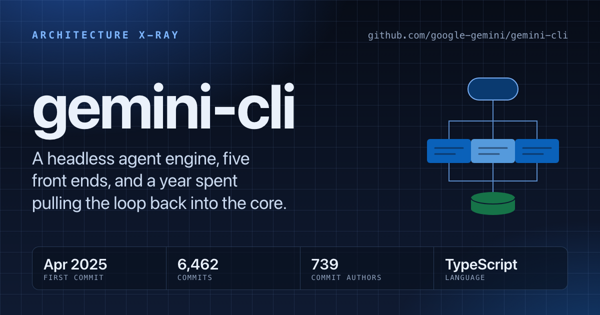
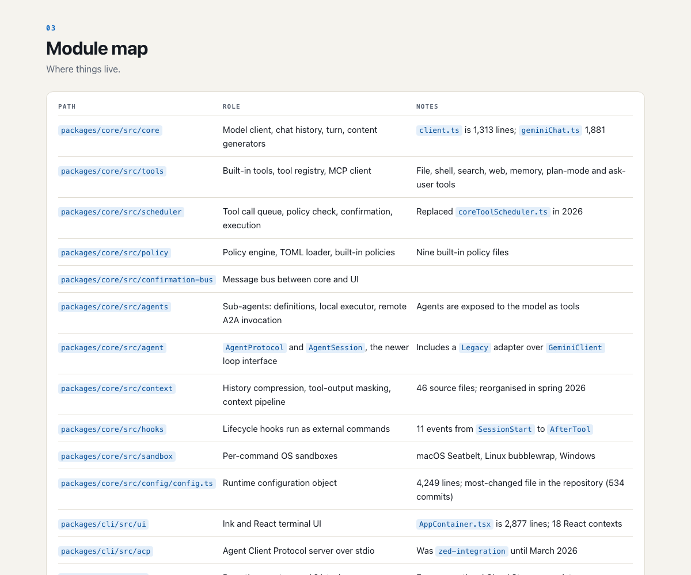
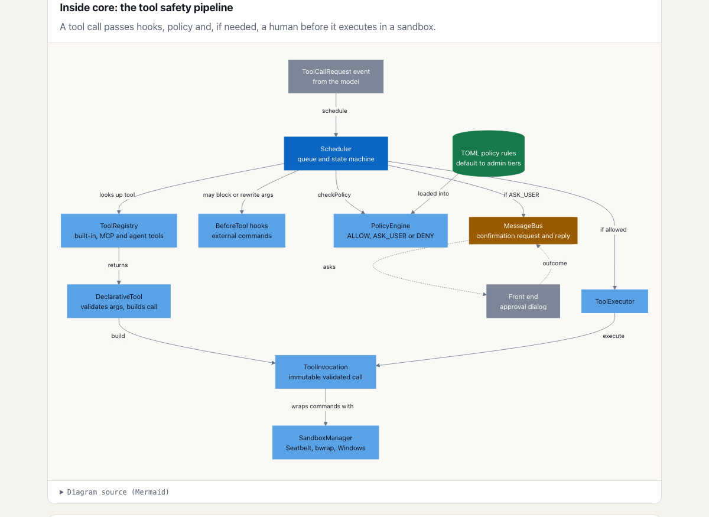
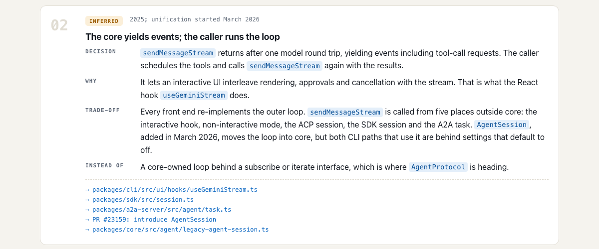
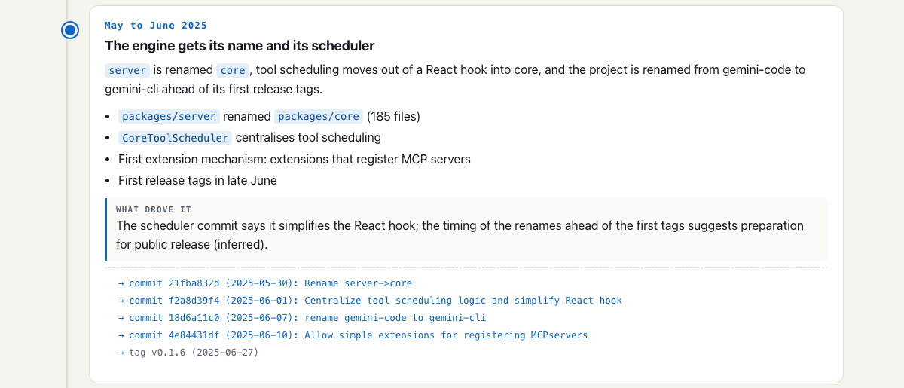

# claude-plugins

Plugins for [Claude Code](https://claude.com/claude-code). The first one is **architect**: point it at any repository and get an architecture case study, or give it a problem and get designs to choose from.

[](https://antriksh29071989.github.io/claude-plugins/xray/gemini-cli/)

**[See a live example: gemini-cli, X-rayed →](https://antriksh29071989.github.io/claude-plugins/xray/gemini-cli/)**

## Quick start

In Claude Code:

```
/plugin marketplace add Antriksh29071989/claude-plugins
/plugin install architect@antriksh-plugins
```

Then:

```
/architect:xray https://github.com/google-gemini/gemini-cli
```

When it finishes you have `xray/gemini-cli/index.html`: one self-contained page you can open, host or share.

## What `/architect:xray` gives you

Everything below is the output for [google-gemini/gemini-cli](https://github.com/google-gemini/gemini-cli) (6,462 commits, analysed at one commit).

### The architecture at a glance

The central idea in a paragraph, measured stats, and the patterns in use. Each pattern links to the files where you can see it.



### C4-style diagrams

Context, containers, the key components and one traced request, drawn from the code.



### Key design decisions, and why

What was chosen, the reasoning, the trade-off and what was rejected. Every decision is labelled by how the reasoning is known:

- **documented** - the maintainers said so, with a link to the pull request, issue or doc
- **inferred** - read from the code and history
- **speculative** - plausible, not evidenced



### How the architecture evolved

The turning points in order and what drove each, found from tags, directories appearing and disappearing, and large refactors, then checked against the actual commits.



### Also on the page

A module map, strengths and risks, transferable lessons, and a method section that says what was not examined.

### A share card

Each build writes a 1200×630 `card.png` (the image at the top of this README) and puts link-preview tags in the page, so a published X-ray unfurls with an image on LinkedIn, Slack and similar.

## Usage

```
/architect:xray <git URL or local path> [focus area]
```

| Example | What happens |
|---|---|
| `/architect:xray https://github.com/pallets/flask` | Clones (history only), analyses, writes `xray/flask/` |
| `/architect:xray .` | Analyses the repository you are in, without modifying it |
| `/architect:xray https://github.com/org/repo the plugin system` | Weights the analysis toward one area |

Output, in the directory you run it from:

```
xray/<project>/
  index.html   # the case study
  card.png     # share card
  xray.json    # the structured analysis the page is rendered from
```

Requirements: `git` and `python3`. The share card needs Chrome, Chromium, Edge or Brave. The GitHub CLI (`gh`) is used for pull-request context if present.

## How it works

1. **Clone** with `--filter=blob:none`: full history, file contents fetched only when read.
2. **Measure** the history with [`history.py`](plugins/architect/skills/xray/scripts/history.py): commits and authors per year, release tags, when each directory appeared and disappeared, the largest commits, the most-changed files.
3. **Read** the code: docs, manifests, entry points, core abstractions, one operation traced end to end.
4. **Analyse**: name the patterns, find the decisions and their reasons, reconstruct the eras, verifying each against real commits.
5. **Write** `xray.json`, a structured data file ([schema](plugins/architect/skills/xray/references/report-schema.md)).
6. **Render** with [`build.py`](plugins/architect/skills/xray/scripts/build.py), which validates the data and fills a fixed [template](plugins/architect/skills/xray/assets/template.html).

Because the model writes data and a template renders it, every X-ray looks the same, the build rejects incomplete analyses (a decision with no evidence fails), and you can edit `xray.json` and re-render without re-running the analysis:

```
python3 plugins/architect/skills/xray/scripts/build.py xray/<project>/xray.json xray/<project>/index.html
```

### Accuracy

The skill is written to cite a file, commit, tag or link for every claim, to never present an inference as the maintainers' intent, and to treat prior knowledge of a famous project as a lead to verify, not a finding. It is still an AI reading of someone else's code: check the **inferred** decisions before you publish about a project.

## The other skill: `/architect:design`

Give it a problem instead of a repository:

```
/architect:design design a notification service for 5M daily users across push, email and SMS
```

It frames and sizes the problem, applies the architecture literature, researches how large engineering organisations solved it, and writes 2-3 contrasting designs with C4 diagrams, a trade-off matrix, a recommendation and a decision record to `docs/architecture/<problem>/`.

Example output: [a production ReAct agent](docs/architecture/production-react-agent/README.md).

## Repository layout

```
.claude-plugin/marketplace.json     # marketplace manifest listing every plugin
plugins/architect/
  .claude-plugin/plugin.json        # plugin manifest
  skills/xray/                      # SKILL.md, scripts/, assets/, references/
  skills/design/                    # SKILL.md, references/
  agents/industry-researcher.md     # subagent used by design
xray/                               # published X-rays (served by GitHub Pages)
docs/architecture/                  # example design output
index.html                          # gallery page for GitHub Pages
```

## Developing

Run a plugin from a local clone without installing it:

```
claude --plugin-dir ./plugins/architect
```

Validate after changing a manifest:

```
claude plugin validate .
```

The skill's behaviour lives in [`skills/xray/SKILL.md`](plugins/architect/skills/xray/SKILL.md); the page's look lives in the template. Issues and pull requests are welcome.
