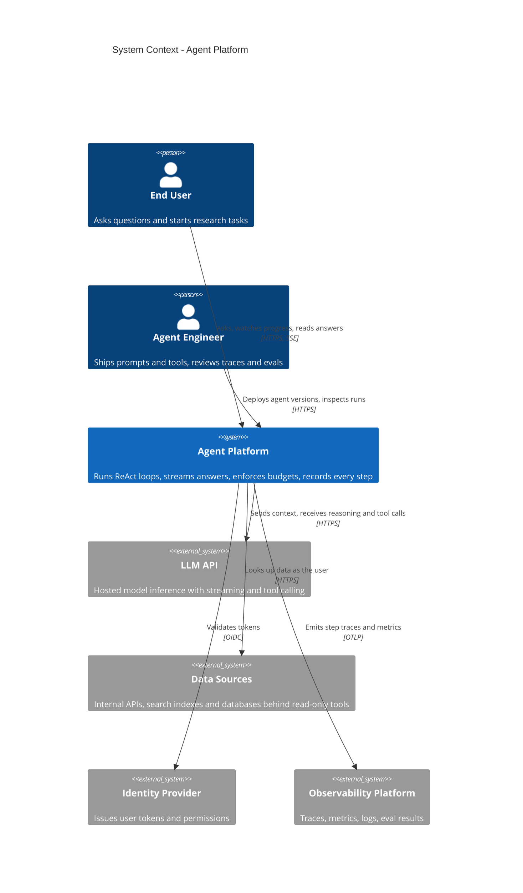

# Production ReAct Agent - Architecture Options

> Status: Proposed · Date: 2026-10-03 · Recommendation: **Option 1 - Event-logged loop in one service**, with a defined trigger for moving long runs to Option 2

## 1. Problem

Design the production architecture for a ReAct-style agent: a loop in which a model reasons, calls tools, observes the results and repeats until it can answer. The agent serves interactive questions (a user waiting) and long-running background tasks, using read-only lookup tools.

**In scope:** the runtime that executes the loop, its state, streaming to users, model and tool integration, limits, observability, and the evaluation gate.
**Out of scope:** prompt and tool content, the client UI, tools with side effects, code execution, multi-agent orchestration, multi-region active-active.

## 2. Assumptions

| # | Assumption | Source |
|---|---|---|
| 1 | Both interactive and long-running tasks | Given |
| 2 | ~100,000 runs/day at launch | Given |
| 3 | Tools are read-only lookups | Given |
| 4 | Team of 2-5 engineers on a managed cloud, no platform team | Given |
| 5 | Mix: 90% interactive (avg 6 steps, ~30 s), 10% long (avg 40 steps, ~10 min) | Assumed |
| 6 | Peak is 5x average for interactive, 3x for long | Assumed |
| 7 | Static prefix (system prompt + tool definitions) of 4k tokens; each step adds 1.5k tokens interactive, 2.6k long; output 500-600 tokens per step including reasoning | Assumed - measure on real transcripts |
| 8 | Single region, multi-zone; 99.5% monthly availability target | Assumed |
| 9 | Model tier is undecided; costs shown for three tiers at Anthropic list prices | Assumed |
| 10 | Multi-tenant, with users' own permissions applied to every lookup | Assumed |

## 3. Requirements

### Functional
1. Run the reason-act-observe loop with parallel tool calls and hard stop conditions.
2. Stream progress and answer tokens to the user; allow reconnect mid-run.
3. Run long tasks in the background and survive process loss and deploys.
4. Enforce per-run and per-tenant budgets (steps, tokens, wall clock, cost).
5. Record every step for audit, debugging and evaluation.
6. Gate prompt, tool and model changes on an evaluation set.

### Quality-attribute scenarios

| # | Attribute | Scenario | Measure |
|---|---|---|---|
| Q1 | Reliability | A worker is killed mid-run during a deploy | Run completes; at most one step repeated; no duplicate or forked history |
| Q2 | Reliability | The LLM API returns errors for 2 minutes | Long runs pause and resume; interactive runs fail over or fail clearly within 10 s |
| Q3 | Cost | Normal operation | Cache-read share of input tokens above 80%; cost per run tracked and capped |
| Q4 | Latency | Interactive question at peak | First streamed token p50 under 2 s, p95 under 4 s; platform overhead under 50 ms per step |
| Q5 | Operability | A run gives a wrong answer | An engineer can see every step, prompt version, tool call and token count within 5 minutes |
| Q6 | Scalability | Load grows 10x | No redesign; add instances and raise provider limits |
| Q7 | Security | A tool result contains hostile instructions | No data leaves the tenant; no access beyond the calling user's permissions |

### Constraints
Small team; managed services preferred; read-only tools; one region.

## 4. Estimates

**Load**
- 100,000 runs/day / 86,400 s = 1.16 runs/s average; ~5.6/s at peak.
- Concurrent runs: interactive 1.04/s x 30 s = 31 average, ~156 peak. Long 0.116/s x 600 s = 70 average, ~210 peak. **~370 concurrent at peak.**
- Model calls: 90k x 6 + 10k x 40 = **940,000 calls/day**, 10.9/s average, ~45/s peak.

**Tokens per run** (input is re-sent every step, so it grows with the square of step count)
- Interactive: step *i* sends 4.5k + (i-1) x 1.5k tokens. Over 6 steps: 49.5k input, of which ~8k is new and ~41.5k is repeated prefix; ~3k output.
- Long: step *i* sends 4.5k + (i-1) x 2.6k tokens. Over 40 steps: 2.21 M input, of which ~104k is new and ~2.1 M is repeated prefix; ~24k output. Largest single context ~106k tokens.

**Model cost** (list prices per million tokens, from Anthropic's bundled API reference cached 2026-09-25; cache write 1.25x input, cache read as listed)

| Model | Input / Output | Cache read | Interactive run | Long run | Per month at 100k runs/day |
|---|---|---|---|---|---|
| Claude Opus 5.5 | $4 / $20 | $0.20 | $0.108 | $1.42 | **~$718k** |
| Claude Sonnet 5.5 | $2 / $10 | $0.20 | $0.058 | $0.92 | **~$433k** |
| Claude Haiku 4.5 | $1 / $5 | $0.10 | $0.029 | $0.46 | **~$216k** |
| Opus 5.5 with no caching | $4 / $20 | - | $0.258 | $9.32 | ~$3.5 M |

Worked example, Opus 5.5 interactive: 8k x $5/M (write) + 41.5k x $0.20/M (read) + 3k x $20/M (output) = $0.040 + $0.008 + $0.060 = $0.108.

What the numbers say:
- **Model spend is 98% or more of total cost.** Every option's platform cost ($3k-$13k/month) is noise beside it. The architecture should be chosen on reliability and operability, and then judged on whether it protects the cache.
- **Prompt caching is worth about 5x.** Anything that rewrites the prompt prefix mid-run forfeits it.
- **Long runs are 10% of volume and ~60% of spend.** Budgets and context trimming matter most there.
- These rest on assumption 7. Output tokens are over half of an interactive run's cost on Opus, so measured reasoning length will move the totals.
- Batch pricing (50% off) does not apply to a live loop; it does apply to offline evaluation runs.

**Rate limits**
- New (uncached) input: 90k x 8k + 10k x 104k = 1.76 B tokens/day, ~1.2 M tokens/min average, ~5 M at peak. Output: ~510 M/day, ~350k tokens/min average, ~1.5 M at peak. Total input including cache reads: ~18 M tokens/min average.
- This needs negotiated provider limits. It is the first scalability bottleneck in every option.

**Storage**
- ~40 KB per interactive transcript, ~440 KB per long one: ~8 GB/day, ~240 GB/month. One PostgreSQL instance with daily partitions holds 30 days comfortably.

**Compute**
- The loop is I/O-bound waiting on the model. ~370 concurrent runs fits on a handful of async instances; instance counts are set by redundancy, not load.

**To validate:** tokens per step, the 90/10 mix, first-token latency of the chosen model, provider rate limits.

## 5. Architecture drivers

1. **Reliable completion** - a run finishes correctly despite crashes, deploys and model API faults.
2. **Cost per run** - which here means protecting cache efficiency and bounding steps.
3. **Interactive latency** - first token and per-step overhead.
4. **Operability by a small team** - few moving parts, full step-level visibility.
5. **Containment of untrusted tool output** - within a read-only scope.

Deliberately de-prioritised: exactly-once tool side effects (no tool writes), multi-region availability, multi-agent decomposition, raw throughput (the load is small).

## 6. System context

## 7. Options at a glance

**[Option 1 - Event-logged loop in one service](option-1-event-logged-loop.md).** The loop is plain async code in one deployable with two roles (API for interactive, workers for long runs). Each step is appended to a PostgreSQL event log; a crashed run is resumed by replaying the log and redoing the one unfinished step, which is safe because tools are read-only. Service-based style with an event-sourced run. Simplest thing that meets the drivers.

**[Option 2 - Loop as a durable workflow](option-2-durable-workflow.md).** Each run is a workflow on a managed durable-execution service; model and tool calls are activities whose results the engine records and never re-runs. Retries, timers, cancellation and waiting for humans come built in. Optimised for the top driver, at the price of a new programming model, an extra dependency on every step and awkward streaming.

**[Option 3 - Managed agent runtime](option-3-managed-runtime.md).** A provider runs the loop and holds session state; the team keeps a facade and a tool service. Least to build and operate, least control over cost and behaviour, single-provider and beta dependency, and an unmeasured session-start latency for short interactive turns.

## 8. Comparison

| Driver | Option 1: Event-logged loop | Option 2: Durable workflow | Option 3: Managed runtime |
|---|---|---|---|
| 1. Reliable completion | **Adequate.** At most one step redone after a crash; resume logic is self-built and must be kill-tested | **Strong.** Completed steps never re-run; durable timers and signals; replay-versioning discipline required | **Adequate.** Provider-owned and untestable below the API; beta surface |
| 2. Cost per run | **Strong.** Full control of cache layout and trimming; no per-step fee | **Strong.** Same control; +$1.7k-$3.4k/month engine fee (unverified price) | **Weak.** Cache and context strategy are the provider's; +~$5.8k/month session time |
| 3. Interactive latency | **Strong.** ~15 ms overhead per step | **Adequate.** Est. 40-200 ms per step, to be measured | **Unknown.** Per-session workspace start not measured; extra hop per tool call |
| 4. Operability, small team | **Strong.** One codebase, five managed services, familiar skills | **Adequate.** Best run visibility; 2-4 week learning curve; versioning rules | **Strong.** Two stateless services; debugging via provider tooling |
| 5. Injection containment | **Adequate.** Own guardrails; per-user credentials | **Adequate.** Same, plus histories at a third party | **Adequate.** Same for tools; conversation state held by provider |
| Platform cost / month | $2.8k - $8.9k | $4.7k - $12.8k | $7.2k - $11.2k |
| Platform cost at 10x | $17k - $51k | $35k - $87k | $67k - $93k |
| Availability (assumed chain) | ~99.2%; ~99.7% with model fallback | ~99.1%; ~99.6% with model fallback | ~99.3%; no fallback possible |
| Time to first production release | ~8 weeks | ~10-12 weeks | ~4 weeks |
| Main risk | Bugs in self-built resume path | Team struggles with determinism and versioning | Latency and cost control are out of the team's hands |
| One-way doors | Event schema, run API | Engine SDK and workflow structure | Provider's loop semantics |

Model spend (section 4) is the same order in all three and is omitted from the platform rows.

**Strongest case for each**
- *Option 1:* with read-only tools, the hard part of durability - not repeating a side effect - does not exist. What remains is a queue lease and a log replay, which a web team can own and test.
- *Option 2:* the published trajectory of production agents runs from in-process loops to durable execution after incidents. Building on it now avoids a migration, and the day a tool writes or a run waits on a human, it is already the right home.
- *Option 3:* the cheapest architecture is the one you do not build. If the work were mostly long sandboxed tasks, this would likely win.

## 9. Recommendation

**Choose Option 1**, and build it so that Option 2 is a hosting change rather than a rewrite: keep the step function pure, keep the event log append-only, version the event schema.

Why:
- **The scale is small and the tools are read-only.** ~370 concurrent runs and ~45 model calls/s do not need an engine to schedule them, and at-least-once execution of a lookup is harmless. Option 2's central benefit, never repeating a completed step's side effect, is not needed yet.
- **Cost is decided by cache efficiency, not platform choice.** Option 1 gives full control of the prompt prefix and trimming with nothing in the way; Option 3 gives that control up.
- **It protects the interactive path**, which is 90% of traffic: lowest per-step overhead and no unmeasured session start.
- **It fits the team.** No new programming model, and the fastest route to a system the team fully understands.
- **Precedent agrees on the shape.** Anthropic, OpenAI and Cognition all advise a single loop with direct API calls first, state persisted outside the process, and structure added only when needed.

What is given up: built-in durable timers, signals and human-wait steps; engine-grade guarantees on recovery; and the engine's run viewer. The team owns ~a few hundred lines of lease and resume logic and must test them by killing workers at every event boundary.

The honest counter-evidence: Replit moved its agent from an in-process design to Temporal within weeks of launch after losing progress on failures. Two differences limit how far that transfers - its agent writes code and deploys (side effects), and the failures described lost *all* progress, which a per-step event log prevents - but it is a vendor-authored account and the real lesson stands: do not ship the in-process loop without the log and the kill-test.

**Switch to Option 2 when any of these becomes true**
- A tool with side effects is added.
- A run must wait for a human, or last hours to days.
- Sub-tasks need to fan out and join.
- More than one resume-path defect per quarter.

**Choose Option 3 instead if** the workload shifts to mostly long, sandboxed tasks (code or files), the team is one or two people, and measured session-start latency meets the interactive target.

Whichever option is chosen, these apply (and matter more than the choice):
- One byte-stable prompt prefix with caching; track cache-read share as a top-line metric.
- Hard budgets per run: steps, tokens, wall clock, cost.
- An evaluation set (start with ~20 real tasks) gating every prompt, tool and model change; old and new agent versions run side by side during rollout so in-flight runs finish on the version they started with.
- A trace span per step.
- Tools run with the calling user's permissions; no fetch-anything tool alongside private data without an egress allowlist.
- Client-side token bucket in front of the LLM API, shedding long runs before interactive ones.

## 10. Risks and how to retire them

| Risk | Likelihood | Impact | Early test |
|---|---|---|---|
| Token-per-step assumptions are wrong, moving cost by 2x or more | High | High | Week 1: run 200 real tasks through a prototype loop, record tokens, steps, cache-read share |
| Provider rate limits below ~5 M new input tokens/min at peak | Medium | High | Week 1: confirm limits and cache-read accounting with the provider; load test the limiter |
| Resume path forks or loses a run | Medium | High | Week 3: chaos test in CI that kills a worker at every event boundary |
| First-token latency misses 2 s with the chosen model and reasoning effort | Medium | Medium | Week 1: measure across model tiers and effort settings |
| Long-run context growth degrades quality or cost | Medium | Medium | Week 4: compare tool-result clearing vs compaction on the eval set, watching cache-read share |
| Prompt injection through tool results leaks data | Low-Medium | High | Week 5: red-team each tool; verify per-user credentials and egress allowlist |
| Read-only assumption breaks (write tools requested) | Medium | Medium | Product decision review each quarter; trigger for Option 2 |

## 11. Next steps

1. Build a throwaway loop with 3 real tools and measure tokens, steps, latency and cache-read share on 200 tasks. Re-run section 4 with real numbers.
2. Decide the model tier from those measurements and the eval set (quality first, then cost per completed task).
3. Confirm rate limits and data-retention terms with the model provider.
4. Define the event schema (versioned) and the run/event API.
5. Implement `agent-core` with a pure step function, the event log and budgets; add the kill-test.
6. Stand up the eval gate and step tracing before the first external user.
7. Measure Option 3's session-start latency once, so the alternative is judged on data.

## 12. Sources

### Literature
- Richards & Ford, *Fundamentals of Software Architecture* - style ratings (service-based, event-driven) used to position the options; "everything is a trade-off".
- Kleppmann, *Designing Data-Intensive Applications* (1st ed.), ch. 11 Stream Processing - event sourcing and the log as source of truth (Option 1 run store); ch. 5 Replication - single-leader consistency for the event log.
- Hohpe & Woolf, *Enterprise Integration Patterns* - competing consumers, idempotent receiver, process manager, claim check.
- Nygard, *Release It!* - timeouts, circuit breaker, bulkheads, shed load, governor on model and tool calls; failure-mode tables.
- Ford, Richards, Sadalage & Dehghani, *Software Architecture: The Hard Parts* - orchestration vs choreography; when workflow state deserves an orchestrator.
- Beyer et al., *Site Reliability Engineering* - SLOs, handling overload, cascading failures; availability arithmetic.
- Bass, Clements & Kazman, *Software Architecture in Practice* - quality-attribute scenarios.
- Evans, *Domain-Driven Design* - anticorruption layer (Option 3 facade).

### Industry precedents
Gathered by web research on 2026-10-03. Pages were read through summaries, not verbatim; items marked *secondary* or *vendor-authored* carry that caveat.

| Source | What it says | Transfers? |
|---|---|---|
| Yao et al., ReAct (ICLR 2023) - https://arxiv.org/abs/2210.03629 | Defines the reason-act-observe loop | Defines the loop only; nothing on production concerns |
| Anthropic, Building effective agents - https://www.anthropic.com/engineering/building-effective-agents | Simplest thing that works; direct API calls before frameworks; stop conditions; invest in tools | Yes, any team size |
| Anthropic, Effective context engineering - https://www.anthropic.com/engineering/effective-context-engineering-for-ai-agents | Compaction, tool-result clearing, external notes; over-aggressive compaction loses detail | Yes, for long runs |
| Anthropic, Writing tools for agents - https://www.anthropic.com/engineering/writing-tools-for-agents | Fewer consolidated tools, concise results, evals from realistic tasks | Yes |
| Anthropic, Multi-agent research system - https://www.anthropic.com/engineering/multi-agent-research-system | Multi-agent used ~15x chat tokens; checkpoints and resume; side-by-side version rollouts; small eval sets | Multi-agent: no at this cost priority. Evals, rollout and tracing: yes |
| Cognition, Don't build multi-agents - https://cognition.com/blog/dont-build-multi-agents and follow-up https://cognition.com/blog/multi-agents-working | Single-threaded agent first; later allowed multi-agent only with single-threaded writes | Yes: single loop first |
| Temporal, OpenAI Agents SDK integration - https://temporal.io/blog/announcing-openai-agents-sdk-integration | Loop as workflow, model and tool calls as activities, replay from history | Mechanism for Option 2 |
| Temporal, Replit case study (*vendor-authored*) - https://temporal.io/resources/case-studies/replit-uses-temporal-to-power-replit-agent-reliably-at-scale | Moved an in-process agent to Temporal after lost progress | Partly: Replit's agent has side effects; lesson is to persist every step |
| LangChain, Three years of LangChain (*vendor-authored*) - https://www.langchain.com/blog/three-years-langchain | High-level abstractions got in the way in production; checkpointed graphs replaced them | Supports a thin, explicit loop with a checkpoint store |
| Manus, Context engineering for AI agents - https://manus.im/blog/Context-Engineering-for-AI-Agents-Lessons-from-Building-Manus | Cache hit rate is the key production metric; stable prefix, append-only context | Yes, directly; drives the event-log design |
| AWS, Bedrock AgentCore runtime sessions - https://docs.aws.amazon.com/bedrock-agentcore/latest/devguide/runtime-sessions.html | Per-session microVM; only configured storage survives a restart; caller owns user-to-session mapping | Shape of Option 3; isolation is solved, replay is not |
| Meta, Agents Rule of Two - https://ai.meta.com/blog/practical-ai-agent-security/ | An agent should hold at most two of: untrusted input, sensitive data, external actions | Yes: read-only tools keep this design at two |
| OpenAI, A practical guide to building agents (*not read; secondary summaries only*) | Single agent first, layered guardrails | Consistent with the above; unverified |
| Octomind, Why we no longer use LangChain (*not read; snippet only*) | Small team replaced a framework with a plain loop | Consistent; unverified |

Not found: published task volumes for comparable agents, and any public post-mortem on model rate-limit queueing. Workflow-service pricing and limits, cloud infrastructure prices and LLM availability figures in these documents are assumptions to confirm.
