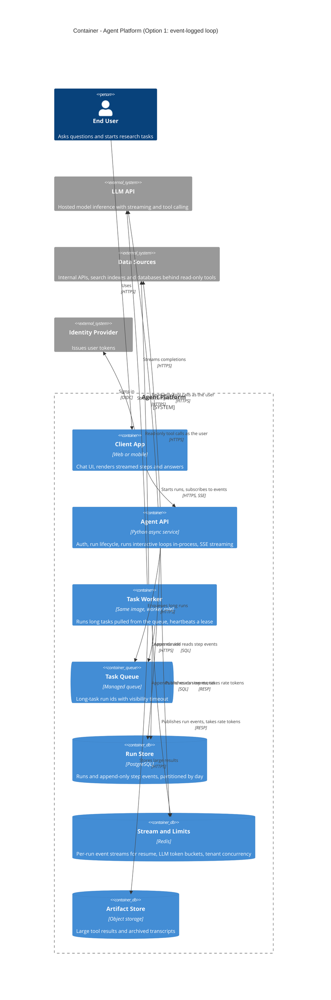
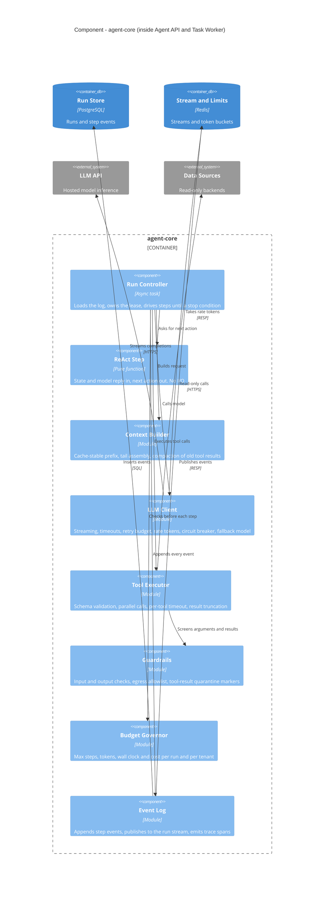
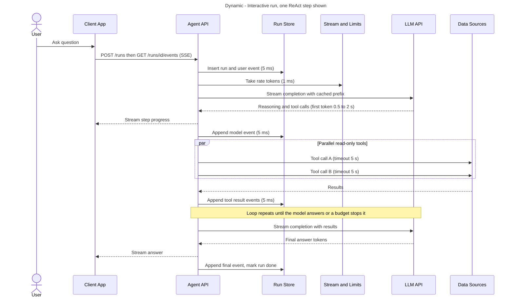
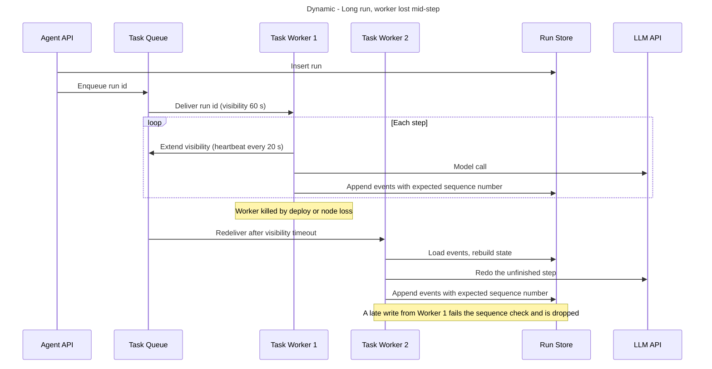
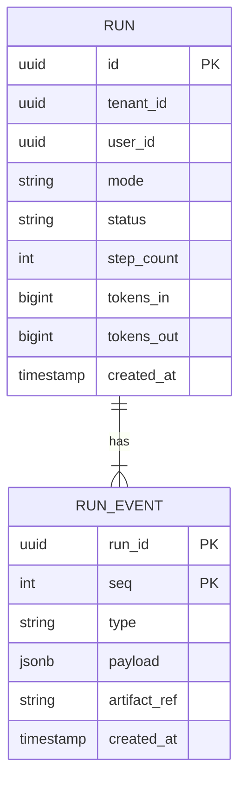
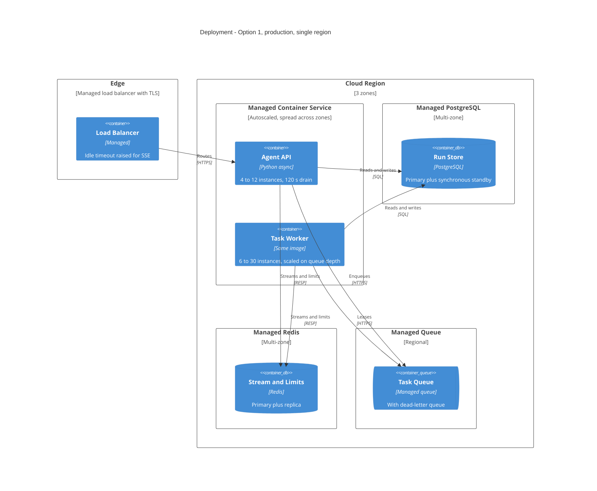

# Option 1 - Event-logged loop in one service

## Thesis

Run the ReAct loop as ordinary async code inside one deployable, and make it crash-safe by appending every step to an append-only event log in PostgreSQL. Interactive tasks run in the API process and stream straight to the user; long tasks run the *same* loop in a worker pool fed by a managed queue. Recovery is "reload the log, redo the step that was in flight". That is only safe because every tool is read-only: repeating a lookup has no side effect, so at-least-once execution is good enough and no workflow engine is needed. The trade: the team owns a small amount of recovery machinery (leases, heartbeats, resume) instead of renting it.

## Style and lineage

- **Style:** service-based / modular monolith - one codebase, two process roles (Richards & Ford, *Fundamentals of Software Architecture*, service-based style: high simplicity and cost ratings, moderate scalability and fault tolerance).
- **State model:** the run is an event-sourced log; current state is derived by replay (Kleppmann, *DDIA* 1st ed., ch. 11, event sourcing and logs as the source of truth).
- **Queue consumption:** competing consumers with an idempotent receiver (Hohpe & Woolf, *Enterprise Integration Patterns*).
- **Stability:** timeouts, circuit breaker, bulkheads, shed load, governor on every outbound call (Nygard, *Release It!*).

## Container view

| Container | Technology | Responsibility | Scales by | State |
|---|---|---|---|---|
| Agent API | Async Python (or TypeScript) on a managed container service | Auth, run lifecycle, interactive loop, SSE | Concurrent streams; add instances | Stateless |
| Task Worker | Same image, worker entrypoint | Long-task loop, lease heartbeat | Queue depth | Stateless |
| Task Queue | Managed queue (SQS-class) | Hand-off and redelivery of long runs | Managed | Run ids only |
| Run Store | Managed PostgreSQL, multi-zone | Source of truth: runs, step events | Vertical, then partition by day and archive | Durable |
| Stream and Limits | Managed Redis | Resume buffer, rate tokens, concurrency counters | Vertical | Ephemeral (rebuildable) |
| Artifact Store | Object storage | Tool results over 16 KB, archived runs | Managed | Durable |

## Component view

The loop lives in one library, `agent-core`, used unchanged by both process roles. This is where the decisions are.

Design rules that make this work:

- **`ReAct Step` is pure.** All I/O is in the controller. The same function can later be hosted inside a workflow engine (Option 2) without rewriting.
- **Append before acting on it.** A model reply is logged before its tool calls run; tool results are logged before the next model call. Resume re-executes at most one step.
- **The prefix never changes within a run.** System prompt and tool definitions are byte-stable and sorted so prompt caching hits; volatile data goes after the last cache breakpoint.
- **Hard stops.** Step, token, wall-clock and cost budgets end a run with a partial answer rather than looping.

## Critical flows

### Interactive run (budget: first token under 2 s, platform overhead under 50 ms per step)

### Long run surviving a worker crash

## Data design

- **Ownership:** only `agent-core` writes the Run Store. One writer per run at a time, enforced by the queue lease plus an optimistic check: `INSERT ... (run_id, seq)` with a unique key, so a zombie worker cannot fork the history.
- **Events, not snapshots.** Storing the full state at every step is quadratic: a 40-step run with ~55k tokens average context is about 8.8 MB per run, or 88 GB/day for long runs alone. Appending deltas is about 0.44 MB per long run, 8 GB/day in total.
- **Partitioning:** `run_event` range-partitioned by day; partitions older than 30 days exported to the Artifact Store and dropped. Key for any future sharding: `tenant_id, run_id`.
- **Consistency:** the event log is strongly consistent (single primary, synchronous standby). The Redis run stream is a best-effort copy; a client that reconnects past the buffer reads from PostgreSQL.

## Deployment view

## Quality-attribute analysis

### Reliability of task completion
- Process loss costs at most one step of rework: about 3 s interactive, up to 30 s on a long run, plus up to 60 s redelivery delay.
- Deploys: interactive runs finish inside a 120 s drain (average run 30 s); anything cut off resumes from the log when the client reconnects. Long runs are redelivered.
- Poison runs go to a dead-letter queue after 3 deliveries.
- Weak point: correctness of the resume path is the team's own code. It needs a kill-test in CI (terminate a worker at every event boundary and assert the run completes with one consistent history).

### Cost
- Platform overhead is negligible next to model spend (see below). Nothing in this option adds per-step fees.

### Latency
- Platform overhead per step: two PostgreSQL appends (~5 ms each), one Redis call (~1 ms), in-process dispatch. About 15 ms, against 2-5 s for the model call. The loop adds under 1% to a run.
- First token: one insert and one rate-token check precede the model call, about 10 ms.

### Scalability
- Peak load is ~370 concurrent runs and ~45 model calls/s. One async instance can hold several hundred idle-waiting runs; the instance counts above are for zone redundancy, not throughput.
- **First bottleneck is the LLM rate limit, not this system.** Second is PostgreSQL write volume: ~2 M event inserts/day now (trivial), ~20 M/day at 10x (still one primary). Partition-by-day keeps tables small.
- Path to 10x: more instances, a larger database instance, and a negotiated model rate limit. No redesign.

### Availability
Serial dependencies (assumed figures): load balancer 99.99% x compute 99.95% x PostgreSQL 99.95% x Redis 99.9% x LLM API 99.5% x data sources 99.9% = about **99.2%**, dominated by the LLM API. With a fallback model on an independent endpoint the LLM term becomes about 99.99% and the chain about **99.7%**. Redis can be made non-critical (fall back to polling PostgreSQL, fail open on rate tokens) to remove its term.

### Operability
- Five managed services, one codebase, one on-call runbook. No new technology for a typical web team.
- Every step is a trace span carrying run id, step, model, tokens, cache-read tokens, tool and latency.

## Cost

Model spend is common to all options and computed in the summary. Platform cost for this option (rough cloud list-price estimates, not quotes):

| Item | Launch (100k runs/day) | 10x | Assumption |
|---|---|---|---|
| Compute (API + workers) | $600 - $1,500 | $4k - $10k | 10-40 small instances at $50-$100/month |
| PostgreSQL, multi-zone | $800 - $1,500 | $3k - $6k | 30 days hot, ~250 GB then ~2.5 TB |
| Redis, multi-zone | $200 - $400 | $800 - $1,500 | Small HA pair |
| Queue, load balancer, egress | $150 - $400 | $1k - $3k | Text payloads only |
| Object storage | $10 - $80 | $100 - $800 | ~240 GB/month growth, a year retained |
| Tracing and logs | $1,000 - $5,000 | $8k - $30k | ~8 GB/day; vendor pricing varies widely, sample at 10x |
| **Platform subtotal** | **$2.8k - $8.9k** | **$17k - $51k** | Under 2% of model spend |
| People | 2-3 engineers to build over ~8 weeks; one on-call rotation | Same | Web-service skills only |

## Failure modes

| Failure | Effect | Blast radius | Detection | Mitigation |
|---|---|---|---|---|
| LLM API errors or slow | Steps fail or stall | All runs | Error rate, time-to-first-token | Timeout per call, retry with jitter under a retry budget, circuit breaker, fallback model; long runs park and retry |
| LLM rate limit hit | 429s | All tenants | 429 rate, token-bucket depth | Client-side token bucket in Redis, per-tenant concurrency caps, shed long runs before interactive |
| Tool backend down | Tool errors | Runs needing that tool | Per-tool error rate | Return the error to the model as a tool result, per-tool circuit breaker and bulkhead |
| Worker or API crash | One step lost | One run | Lease expiry | Redelivery and resume from the log |
| Bad deploy (prompt or code) | Wrong answers or loops | All new runs | Eval gate in CI, canary success and steps-per-run metrics | Versioned prompts and tools, canary at 5%, instant rollback; budgets cap runaway loops |
| PostgreSQL primary lost | Writes pause | All runs for 1-2 min | Managed failover alarm | Automatic failover; runs retry appends |
| Redis lost | Streams drop, limits unavailable | Live streams | Health check | Clients fall back to polling the log; limiter fails open with a static cap |
| Zone lost | Capacity drop | One third of instances | Platform alarms | Instances spread over 3 zones, standby promotion |
| Region lost | Outage | Everything | Platform alarms | Out of scope at launch: restore from backup in a second region (RTO hours, RPO minutes) |
| Prompt injection in tool results | Model follows hostile text | One run, bounded by read-only scope | Guardrail hits, unusual tool arguments | See security |

## Security and compliance

- **Trust boundaries:** client to API (user token), API to data sources (the *user's* delegated credential, never a platform super-user), platform to LLM API (provider key in a secrets manager).
- **Tool results are untrusted input.** Read-only tools cannot change data, but an agent that can read private data and also fetch arbitrary URLs can leak it. Controls: tools run with the caller's permissions, egress allowlist on any fetch-style tool, no tool that both reads private data and writes to an attacker-visible place, tool results delimited and labelled as data.
- **Tenancy:** `tenant_id` on every row with row-level security; per-tenant rate and cost budgets.
- **Data:** transcripts contain user data: encrypt at rest, 30-day hot retention, redact secrets before logging, confirm the LLM provider's retention terms match policy.

## Evolution

- **Easy later:** swapping models, adding tools, adding a fallback provider, moving long runs to a workflow engine (the step function is already pure and the log already has the shape of a workflow history).
- **One-way doors:** the event schema (version it from day one) and the public run/event API.
- **Trigger to move to Option 2:** the first tool with side effects; runs that must wait hours or days for a human; sub-tasks fanned out and joined; or more than one resume-path bug per quarter.

## Precedents

- Anthropic, OpenAI and Cognition all advise starting with a single loop and direct API calls, adding structure only when needed (see summary sources).
- LangGraph-based production agents (Uber, LinkedIn, Klarna, as claimed by LangChain) use the same shape: a loop with per-step checkpoints in PostgreSQL. This option keeps the shape without the framework, and stores deltas rather than full checkpoints.
- Manus reports cache hit rate as the key production metric and an append-only context as the way to protect it, which is why the log here is append-only.
- Counter-case: Replit moved an in-process agent to a workflow engine after failures lost all progress (vendor-authored). That agent has side effects; the lesson taken here is to never run the loop without the per-step log.

## Strengths / Weaknesses / When to choose this

- **Strengths:** fewest moving parts, lowest per-step overhead, no engine constraints on streaming or payload size, team already knows every component.
- **Weaknesses:** recovery logic is self-built; no built-in timers, signals or long waits; discipline needed to keep the step function pure.
- **Choose when:** tools are read-only or idempotent, runs last minutes not days, and the team is small.
