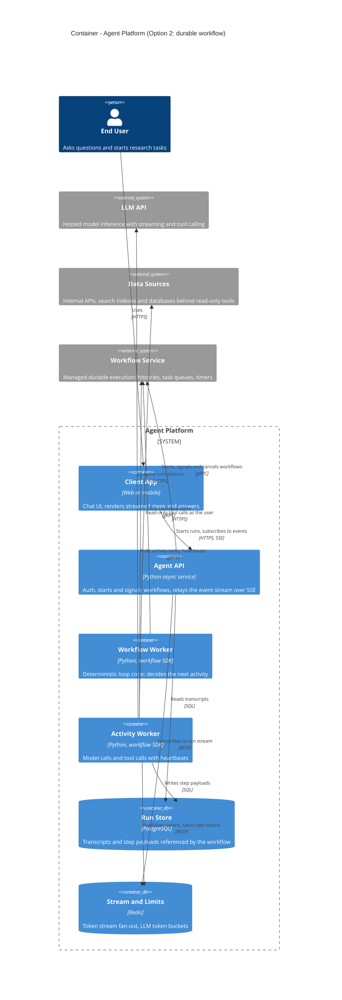
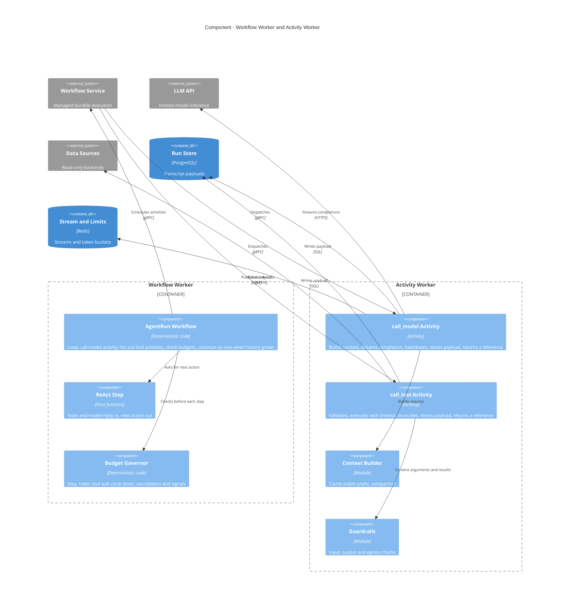
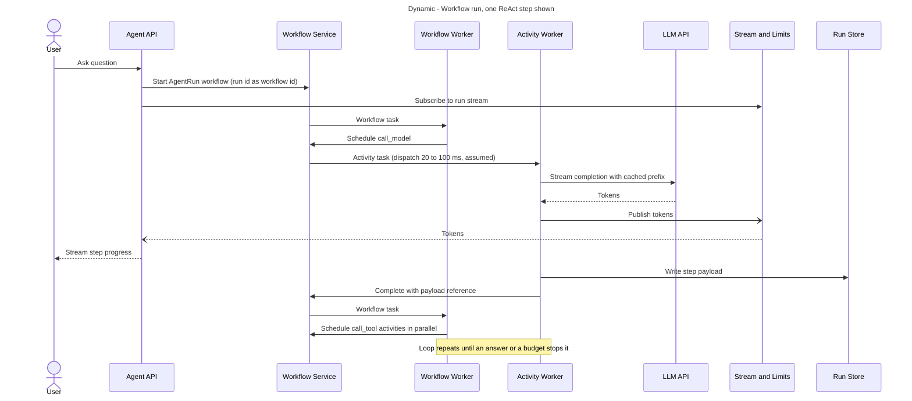
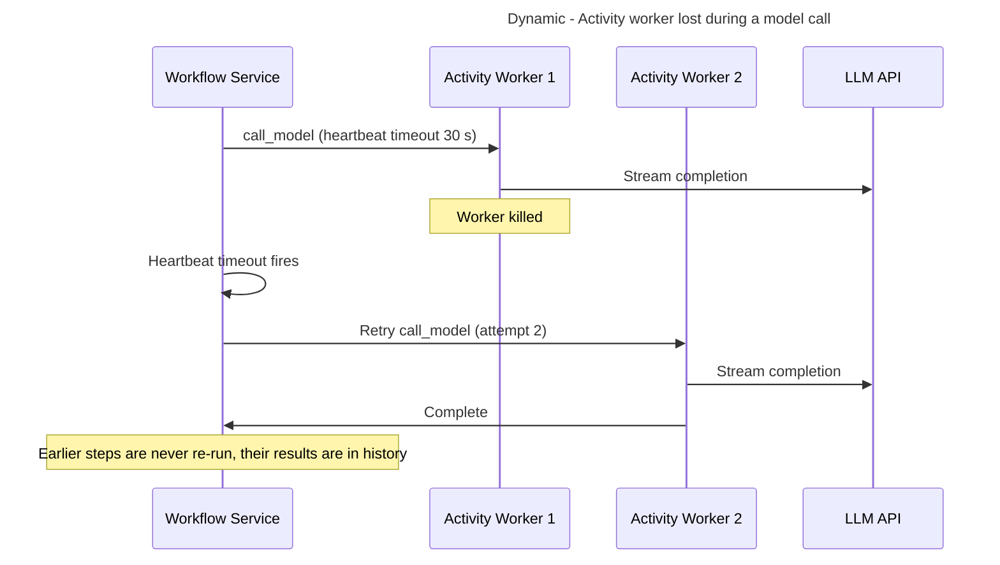
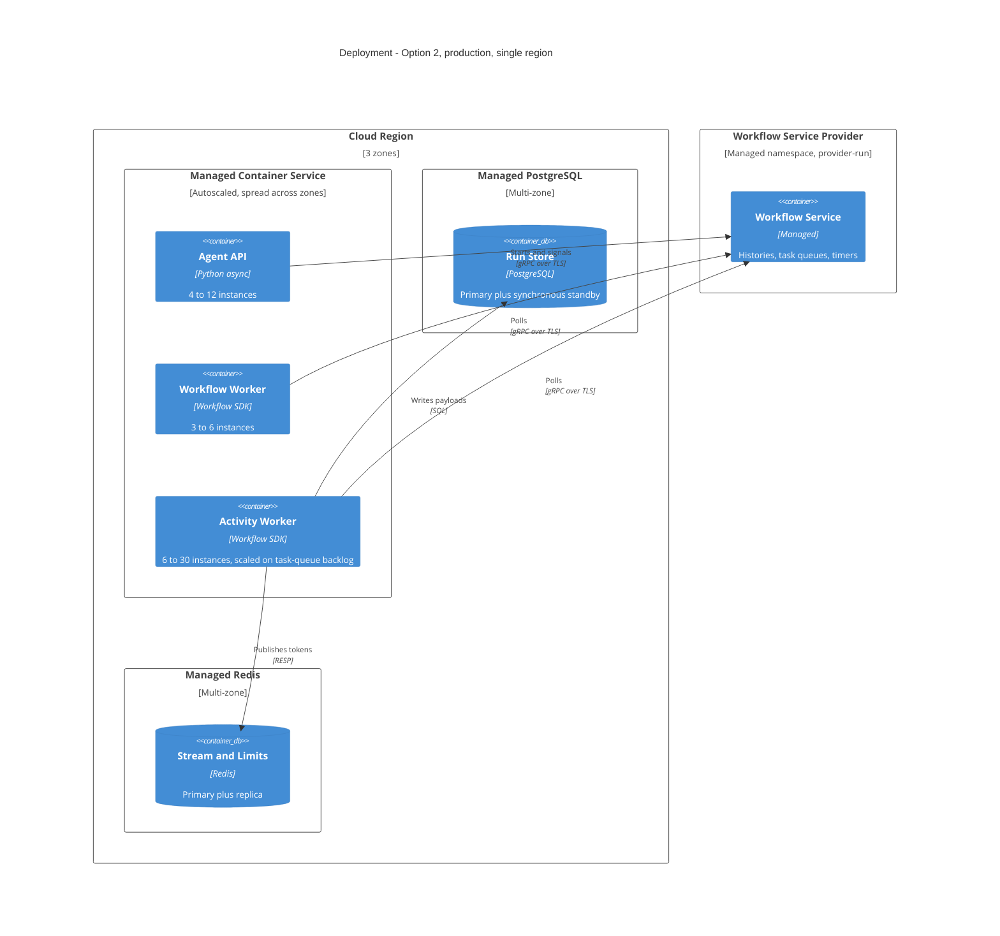

# Option 2 - Loop as a durable workflow

## Thesis

Run each agent run as a workflow on a managed durable-execution service. The loop is workflow code; every model call and tool call is an activity whose result the engine records. If a worker dies, another replays the recorded history and continues from the exact point of failure. Retries, timeouts, timers, cancellation and "wait for a human" come from the engine instead of from the team. The trade: a new programming model with real constraints (deterministic workflow code, history and payload size limits, no native token streaming) and a per-action fee, in exchange for not owning recovery logic.

## Style and lineage

- **Style:** orchestrated, event-driven workers (Richards & Ford, *Fundamentals of Software Architecture*, event-driven style with a mediator; Ford et al., *Software Architecture: The Hard Parts*, orchestration vs choreography).
- **Pattern:** process manager (Hohpe & Woolf, *Enterprise Integration Patterns*); orchestrated saga when tools gain side effects (Richardson, *Microservices Patterns*).
- **Large payloads:** claim check (Hohpe & Woolf) - transcripts live in the Run Store, the workflow carries references.

## Container view

| Container | Technology | Responsibility | Scales by | State |
|---|---|---|---|---|
| Agent API | Async Python | Auth, workflow start/signal, SSE relay | Concurrent streams | Stateless |
| Workflow Worker | Workflow SDK | Loop decisions only, no I/O | Workflow task rate | Stateless (replay) |
| Activity Worker | Workflow SDK | Model and tool calls | Concurrent activities | Stateless |
| Workflow Service | Managed (Temporal Cloud class) | History, dispatch, timers, retries | Managed | Durable |
| Run Store | Managed PostgreSQL | Transcript payloads | Vertical | Durable |
| Stream and Limits | Managed Redis | Token streaming side channel, rate tokens | Vertical | Ephemeral |

## Component view

Constraints the engine imposes:

- **Workflow code must be deterministic.** No clock, randomness, network or model calls inside it; all of that goes in activities. Code changes to a running workflow need versioning.
- **History is bounded.** Engines cap history length and payload size (Temporal documents limits in the tens of thousands of events and megabytes of payload - confirm current values). A 40-step run is ~250 events, comfortably inside; transcripts must still be stored outside the history and referenced, and very long runs must continue-as-new.
- **Activities do not stream.** Tokens are published to Redis from inside the activity as a side channel; the durable result is only the completed step.

## Critical flows

### One step of a run (budget: under 150 ms platform overhead per step)

### Activity worker lost mid-call

## Data design

- **Source of truth for control flow:** the engine's workflow history, replicated by the provider.
- **Source of truth for content:** Run Store rows keyed by `run_id, step`; the workflow holds only references and counters. Activities write with an idempotency key (`run_id, step, attempt-independent id`) so a retried activity overwrites rather than duplicates.
- **Consistency:** each activity result is recorded exactly once in history; activity *execution* is at-least-once, which is harmless for read-only tools and the reason idempotency keys become mandatory once tools write.
- **Retention:** engine history retention set short (7-30 days); long-term transcript in PostgreSQL/object storage.

## Deployment view

## Quality-attribute analysis

### Reliability of task completion
- Strongest of the three. Completed steps are never repeated; in-flight activities retry under a declared policy; workflows survive deploys of any length.
- Timers and signals are durable: cancel, pause, "wait for approval for 3 days" and scheduled follow-ups need no extra infrastructure.
- New failure class: non-determinism errors when workflow code changes under running workflows. Needs replay tests in CI.

### Cost
- Engine fee is per action. About 15 actions per interactive run and ~90 per long run gives 90k x 15 + 10k x 90 = 2.25 M actions/day, ~68 M/month. At an assumed $25-$50 per million actions that is **$1.7k - $3.4k/month** (verify against the provider's current price list).

### Latency
- Each activity adds a dispatch round trip through the engine, assumed 20-100 ms (must be measured). At ~2 activities per step that is 40-200 ms per step, 0.25-1.2 s over a 6-step interactive run: noticeable but small against ~20 s of model time.
- First token: workflow start plus first dispatch adds an estimated 50-200 ms before the model call.

### Scalability
- Workers scale horizontally on backlog; the service is provider-scaled. First bottleneck is still the LLM rate limit; second is the provider's namespace action-rate limit (~26 actions/s average, ~130/s at peak here - confirm the default quota).

### Availability
Chain (assumed): load balancer 99.99% x compute 99.95% x workflow service 99.9% x PostgreSQL 99.95% x Redis 99.9% x LLM 99.5% x data sources 99.9% = about **99.1%**; about **99.6%** with an LLM fallback. One more hard dependency than Option 1, and it is on the path of every step.

### Operability
- Excellent run-level visibility out of the box (history viewer, retry counts, stuck-workflow search).
- Costs the team a new mental model. Expect 2-4 weeks for the first engineers to become productive and ongoing care around versioning.

## Cost

| Item | Launch (100k runs/day) | 10x | Assumption |
|---|---|---|---|
| Compute (API + workers) | $800 - $2,000 | $5k - $12k | Three process roles |
| Workflow service | $1,700 - $3,400 | $17k - $34k | 68 M then 680 M actions/month at $25-$50/M, unverified |
| PostgreSQL, multi-zone | $800 - $1,500 | $3k - $6k | Payloads only |
| Redis, multi-zone | $200 - $400 | $800 - $1,500 | Streaming side channel |
| Load balancer, egress, storage | $150 - $450 | $1k - $3.5k | |
| Tracing and logs | $1,000 - $5,000 | $8k - $30k | Engine history offsets some tracing need |
| **Platform subtotal** | **$4.7k - $12.8k** | **$35k - $87k** | Still under 3% of model spend |
| People | 2-3 engineers, ~10-12 weeks including the learning curve | Same | Durable-execution skills to acquire |

## Failure modes

| Failure | Effect | Blast radius | Detection | Mitigation |
|---|---|---|---|---|
| LLM API errors or slow | Activity retries | All runs | Activity failure rate | Activity retry policy with backoff, start-to-close and heartbeat timeouts, fallback model in the activity |
| LLM rate limit hit | 429s | All tenants | 429 rate | Token bucket in Redis; task-queue rate limit on the model activity |
| Workflow service outage | No step can advance; no new runs | Everything | Provider status, schedule-to-start latency | None at step level; runs resume automatically on recovery. Interactive UX shows degraded state |
| Worker crash | Activity retried or workflow replayed | One step | Heartbeat timeout | Built in |
| Bad deploy (workflow code) | Non-determinism errors, stuck workflows | In-flight runs | Replay test in CI, workflow task failure alarm | Worker versioning, patch markers, rollback |
| Bad deploy (prompt) | Wrong answers | New runs | Eval gate, canary metrics | Prompt version pinned at workflow start |
| Redis lost | Token stream stops; runs continue | Live streams | Health check | Client polls completed steps from the Run Store |
| Zone lost | Capacity drop | One third of workers | Platform alarms | Workers across zones; service is provider-redundant |
| Region lost | Outage | Everything | Platform alarms | Provider multi-region namespace is available at extra cost; out of scope at launch |

## Security and compliance

- Same trust boundaries and prompt-injection controls as Option 1.
- **Additional data processor:** workflow histories sit with the engine provider. Keep content out of history (claim check) and encrypt any remaining payloads client-side with a codec so the provider stores ciphertext. Add the provider to the compliance scope.
- Per-tenant isolation by workflow id prefix and task-queue quotas.

## Evolution

- **Easy later:** side-effecting tools as idempotent activities with compensation, human approval via signals, scheduled and recurring runs, sub-workflows for fan-out.
- **One-way doors:** workflow code structure (versioning burden grows with age), dependence on one engine's SDK and semantics.
- **Trigger to simplify back to Option 1:** none of the durable features (signals, timers, long waits, write tools) in use after two quarters, while latency overhead or the learning curve is hurting.

## Precedents

- Temporal documents this exact mapping (loop as workflow, model and tool calls as activities) and ships an integration with the OpenAI Agents SDK.
- Replit runs each agent as one workflow, which also gives one-agent-per-session, after migrating from an in-process design (vendor-authored case study; no trade-offs or volumes published).
- Temporal states that OpenAI uses it for Codex on the web; this was not confirmed from an OpenAI source.
- The published adopters are large or fast-growing products whose agents write code or deploy; evidence for adopting it for read-only work at this scale is thin.

## Strengths / Weaknesses / When to choose this

- **Strengths:** strongest completion guarantees, durable waits and signals, built-in visibility, the natural home for tools with side effects.
- **Weaknesses:** extra hard dependency on every step, determinism and versioning rules, awkward streaming, engine lock-in, slower start for the team.
- **Choose when:** tools write, runs wait on humans or last hours, or sub-tasks fan out and join.
