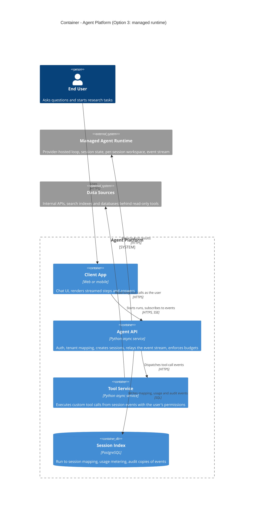
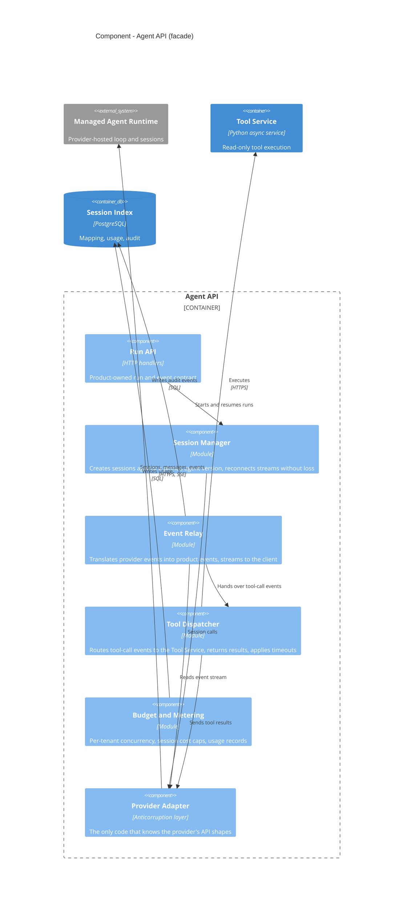
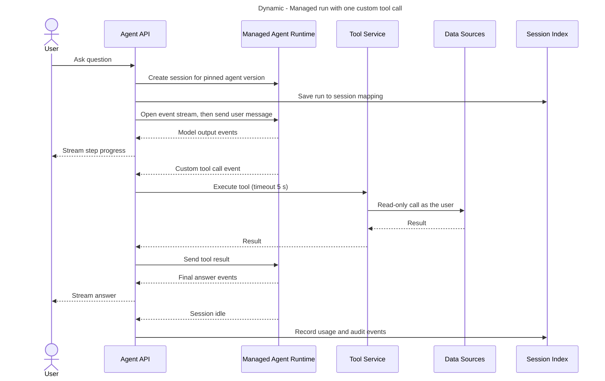
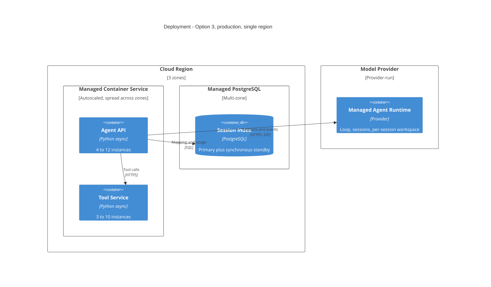

# Option 3 - Managed agent runtime

## Thesis

Do not run the loop at all. A model or cloud provider's managed agent runtime owns the loop, the session state, context management and recovery; the team supplies a versioned agent configuration, a thin API facade and a small service that answers the runtime's tool calls with read-only lookups. The trade: the least code and operations of any option, in exchange for control. The loop, context strategy and caching behaviour become the provider's; the product is tied to one provider's (currently beta) surface; and you pay for a per-session workspace that read-only lookup tools do not use.

Reference product for the analysis: Claude Managed Agents (beta). Equivalents exist from the major clouds (Amazon Bedrock AgentCore, Google Vertex AI Agent Engine); the shape of the trade is the same, the details differ.

## Style and lineage

- **Style:** buy-not-build; the platform is a facade over an external system (Richards & Ford, *Fundamentals of Software Architecture*, on build-vs-buy as an architecture characteristic trade; Evans, *Domain-Driven Design*, anticorruption layer for the facade).
- **Integration:** the facade translates the provider's session and event model into the product's own run/event API so the provider can be replaced (anticorruption layer).

## Container view

| Container | Technology | Responsibility | Scales by | State |
|---|---|---|---|---|
| Agent API | Async Python | Facade: auth, session lifecycle, stream relay, budgets | Concurrent streams | Stateless |
| Tool Service | Async Python | Read-only tool execution | Tool call rate | Stateless |
| Session Index | Managed PostgreSQL | Mapping, metering, audit | Vertical | Durable |
| Managed Agent Runtime | Provider | Loop, state, context management, recovery | Provider | Durable (provider) |

## Component view

## Critical flows

Failure path: if the facade instance dies, the session keeps its state at the provider; another instance looks up the session id in the Session Index, reattaches to the event stream and answers any tool call still pending.

## Data design

- **Conversation state:** owned and stored by the provider. The Session Index keeps only the mapping, usage and an audit copy of events the business must retain.
- **Agent definition:** a versioned configuration (model, system prompt, tools) kept in source control and applied by the deploy pipeline; sessions pin a version.
- **Consistency:** the provider's event stream is the ordering authority. The facade must deduplicate on reconnect.

## Deployment view

## Quality-attribute analysis

### Reliability of task completion
- Loop durability, context compaction and model-error handling are the provider's responsibility and are not something the team can test below the API. Long sessions are a designed-for use case.
- The team's own failure surface shrinks to stream reconnect and tool-result delivery.
- The surface is beta: behaviour and API shapes can change, which is itself a reliability risk for a production feature.

### Cost
- Tokens are billed at the same model list prices as the other options. On top: session running time at $0.08 per hour (list). 90k x 30 s + 10k x 600 s = 8.7 M session-seconds/day = 2,417 hours/day, about **$193/day, $5.8k/month**.
- Less control over the largest lever: prompt-cache layout and context trimming are the runtime's. If its behaviour is less cache-efficient than a hand-tuned loop, a few percent of model spend outweighs every platform saving.

### Latency
- Each session provisions a workspace. Session start latency for a short interactive question is **unknown and must be measured**; if it is seconds, it fails the 2-second first-token target for the 90% of traffic that is interactive.
- Custom tool calls round-trip from provider to facade to data source and back, adding one extra network hop per tool call (estimated 50-150 ms).

### Scalability
- Provider-scaled; limits are quota-based (concurrent sessions, tokens per minute) and must be negotiated for ~370 concurrent sessions at peak and 10x after.

### Availability
Chain (assumed): load balancer 99.99% x compute 99.95% x PostgreSQL 99.95% x managed runtime 99.5% x data sources 99.9% = about **99.3%**. No independent fallback: if the runtime is down, a different model endpoint cannot take over because the loop itself is gone.

### Operability
- Lowest operational load: two stateless services and one small database.
- Debugging depends on the provider's event stream and console rather than the team's own traces.

## Cost

| Item | Launch (100k runs/day) | 10x | Assumption |
|---|---|---|---|
| Compute (API + Tool Service) | $400 - $1,200 | $3k - $8k | Two stateless services |
| Session running time | ~$5,800 | ~$58,000 | $0.08/hour list, 2,417 session-hours/day |
| PostgreSQL, multi-zone | $400 - $900 | $1.5k - $4k | Mapping, usage, audit |
| Load balancer, egress | $100 - $300 | $800 - $2.5k | |
| Tracing and logs | $500 - $3,000 | $4k - $20k | Facade and tools only |
| **Platform subtotal** | **$7.2k - $11.2k** | **$67k - $93k** | |
| People | 1-2 engineers, ~4 weeks | Same | Smallest build |

## Failure modes

| Failure | Effect | Blast radius | Detection | Mitigation |
|---|---|---|---|---|
| Runtime outage or degradation | No runs | Everything | Provider status, session error rate | None without a second implementation; show degraded state |
| Quota or rate limit hit | Session creation fails | All tenants | 429 rate | Per-tenant concurrency caps, queue long runs |
| Tool backend down | Tool errors | Runs needing that tool | Per-tool error rate | Return an error result to the session; circuit breaker in the Tool Service |
| Facade crash | Stream drops | Runs on that instance | Health check | Reattach by session id from the Session Index |
| Bad agent config | Wrong answers | New sessions | Eval gate before applying a version | Sessions pin a version; roll back the version |
| Provider API change (beta) | Facade breaks | Everything | Contract tests against the provider | Adapter layer isolates the change |
| Zone lost | Capacity drop | One third of instances | Platform alarms | Instances across zones |

## Security and compliance

- Conversation content and state are stored by the provider: confirm retention, residency and deletion terms, and whether zero-retention arrangements are compatible with the runtime.
- Tools stay inside the team's boundary: the Tool Service executes with the user's permissions and the runtime never holds data-source credentials.
- Prompt-injection controls still apply to tool results; the provider's own safeguards are additional, not a substitute.
- Availability depends on where the provider offers the runtime: Claude Managed Agents is not offered through Bedrock, Vertex AI or Foundry, which matters if procurement requires buying through a cloud marketplace.

## Evolution

- **Easy later:** code-execution and file tools (the workspace already exists), scheduled runs, outcome-graded runs, sub-agents - if the provider offers them.
- **One-way doors:** dependence on one provider's loop semantics. The facade limits API lock-in but cannot recreate behaviour; leaving means building Option 1 or 2.
- **Trigger to leave:** measured session-start latency over the interactive budget, cache efficiency materially below a self-run loop, or a need for a second model provider.

## Precedents

- Amazon Bedrock AgentCore Runtime: each session runs in its own microVM; on stop or resume only the configured session storage survives, and the caller must own the user-to-session mapping. Isolation is handled for you; replay of your tool calls is not.
- Claude Managed Agents: provider-run loop with a per-session workspace, versioned agent configs and an event stream (beta).
- No published account was found of a managed runtime serving high-volume short interactive turns; that is the gap the latency measurement must close.

## Strengths / Weaknesses / When to choose this

- **Strengths:** fastest to production, least to operate, long-running sessions and sandboxed tools handled for you.
- **Weaknesses:** least control over cost and behaviour, single-provider and beta dependency, unproven fit for short interactive turns, pays for a workspace that read-only tools do not need.
- **Choose when:** the workload is mostly long autonomous tasks needing a sandbox (code, files), the team is one or two people, and single-provider dependence is acceptable.
