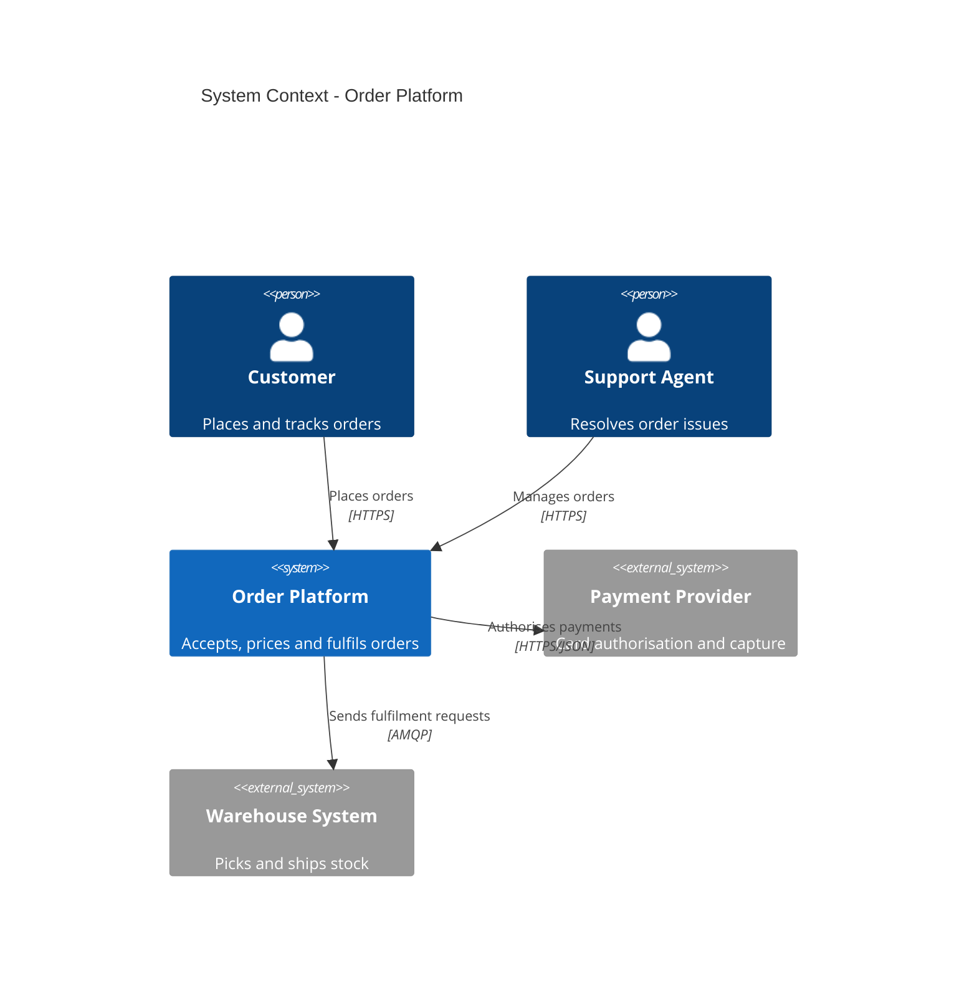
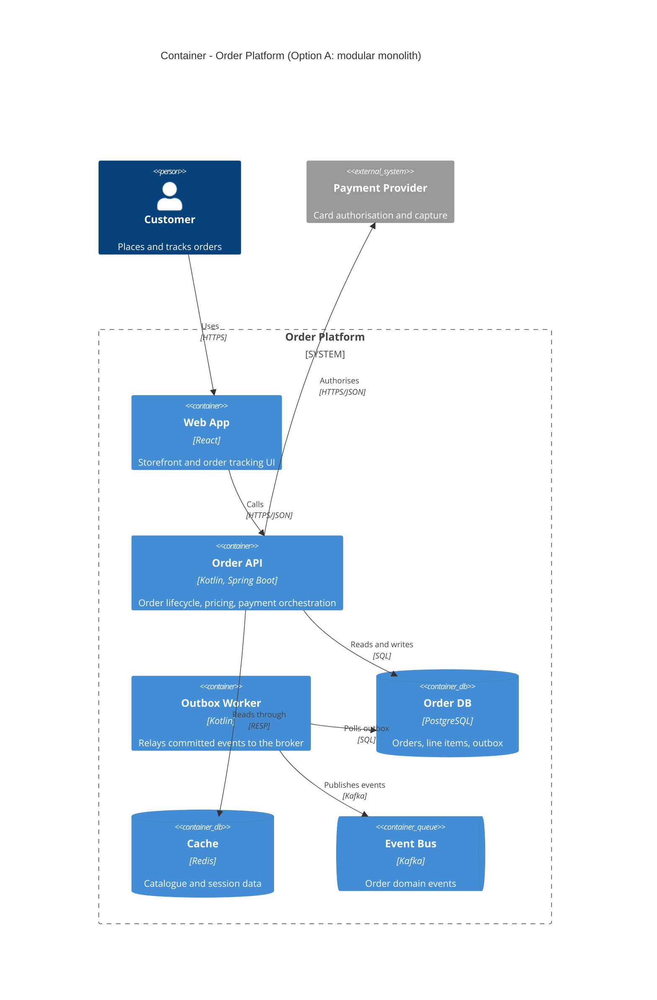
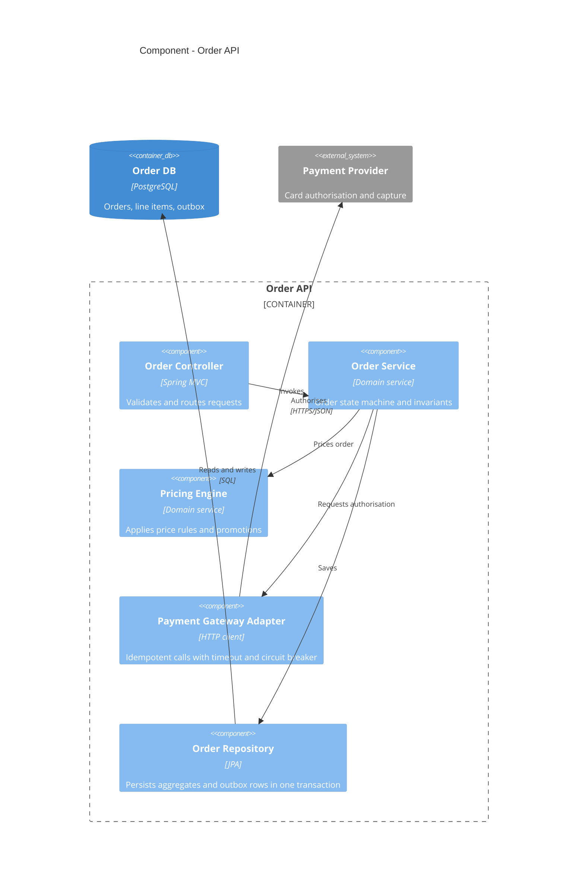
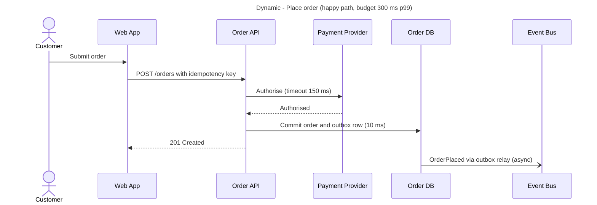
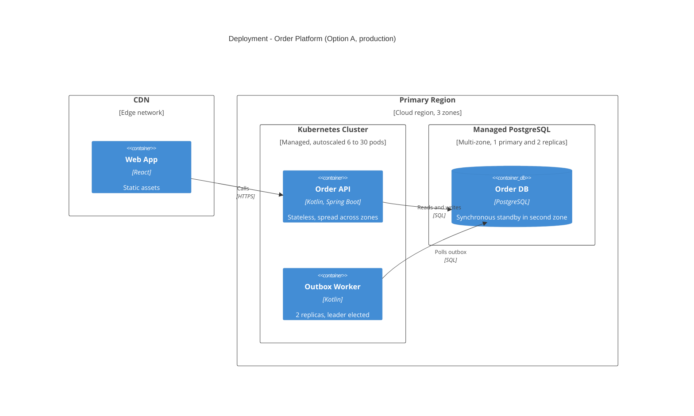
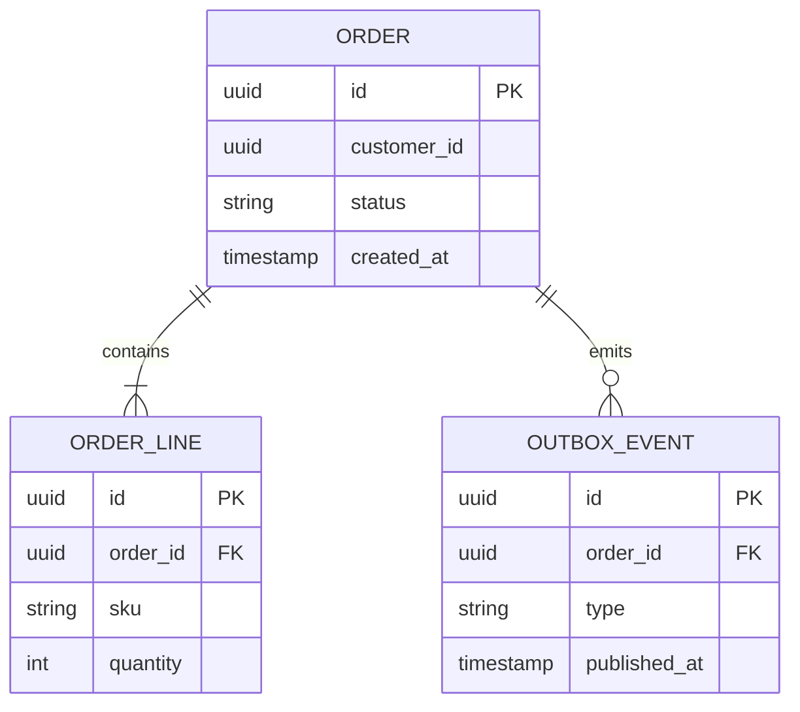

# C4 Model - Diagram Guide

The C4 model (Simon Brown) describes a system at four levels of zoom, plus supplementary views. Draw the levels that carry a decision; skip the ones that would only restate the level above.

## The levels

| Level | Shows | Audience | Draw when |
|---|---|---|---|
| 1. System Context | The system as one box, its users and the external systems it depends on | Everyone | Always. Once, shared by all options. |
| 2. Container | Separately deployable/runnable units and data stores (web app, API, worker, database, queue, bucket) with technology and protocols | Technical | Always. One per option - this is where options visibly differ. |
| 3. Component | The major building blocks inside one container and their responsibilities | Developers | For the one or two containers where the important decisions live. |
| 4. Code | Classes, schemas, interfaces | Developers | Only when a data model or key interface is itself the decision. |

Supplementary views:

- **Dynamic** - how elements collaborate at runtime for one scenario. Draw for the critical path (the hot read, the write that must not be lost, the failure path).
- **Deployment** - how containers map to infrastructure: regions, zones, clusters, managed services. Draw once per option.
- **System Landscape** - several systems together. Only for enterprise-wide problems.

"Container" in C4 means a runnable unit or data store, not a Docker container.

## Notation rules

- Every element has a **name, type, technology (levels 2-3) and a one-line responsibility**.
- Every relationship is **one-directional and labelled with intent and protocol**: "Publishes order events [Kafka]", not "uses".
- Give every diagram a **title** stating level and scope.
- Keep a diagram under about 15 elements. Beyond that, split by scope.
- Do not mix levels of abstraction in one diagram.
- Mark external systems and data stores distinctly (`System_Ext`, `ContainerDb`, `ContainerQueue`).
- Use the same element aliases and names across all diagrams of an option.

## Mermaid syntax

Diagrams are written as Mermaid so they render on GitHub and in most Markdown viewers. Rules that prevent render failures:

- All labels in double quotes. No double quotes inside a label; avoid `<`, `>`, `{`, `}` and line breaks in labels.
- Aliases are plain identifiers: letters, digits, underscore.
- Arguments are positional: `Container(alias, "Label", "Technology", "Description")`.
- Every `{` opened by a boundary is closed on its own line.
- One statement per line.

### Level 1 - System Context

### Level 2 - Container

### Level 3 - Component

### Dynamic view

Use a sequence diagram: it renders reliably and shows ordering, sync vs async, and where latency accrues. Participants must be elements from the Container or Component diagram, with the same names. Annotate the latency budget on the critical steps.

### Deployment view

If a `C4Deployment` diagram becomes hard to read, use a `flowchart TB` with one `subgraph` per region/zone instead - legibility beats notation purity.

### Level 4 - Code (only when needed)

Use `erDiagram` for a data model or `classDiagram` for a key interface.

## Review checklist

- Could someone outside the team tell what each box does and why each arrow exists?
- Does every option's Container diagram make its distinguishing decision visible?
- Are data stores, queues and external systems shown with ownership clear (which container writes to which store)?
- Do the diagrams and the prose name the same elements?
- Does the dynamic view cover the scenario behind the top driver?
